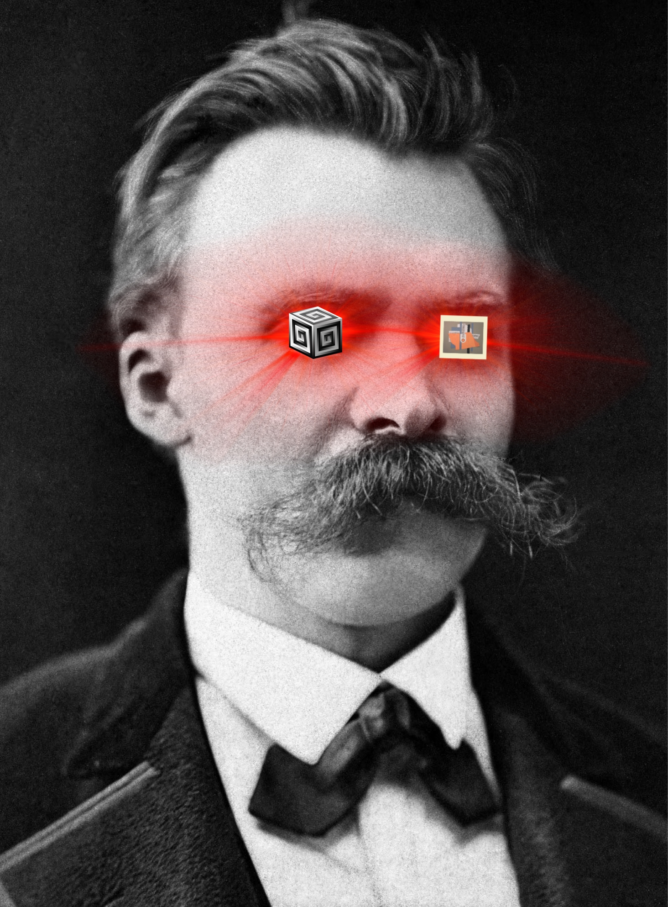

# SuperOM
A SuperCollider class that produces OpenMusic files.


## Installation

Open up SuperCollider and evaluate the following line of code:
```supercollider
Quarks.install("https://github.com/claudiopanariello/SuperOM")
```

## More
You can find IRCAM's Open Music here: https://openmusic-project.github.io/openmusic/
